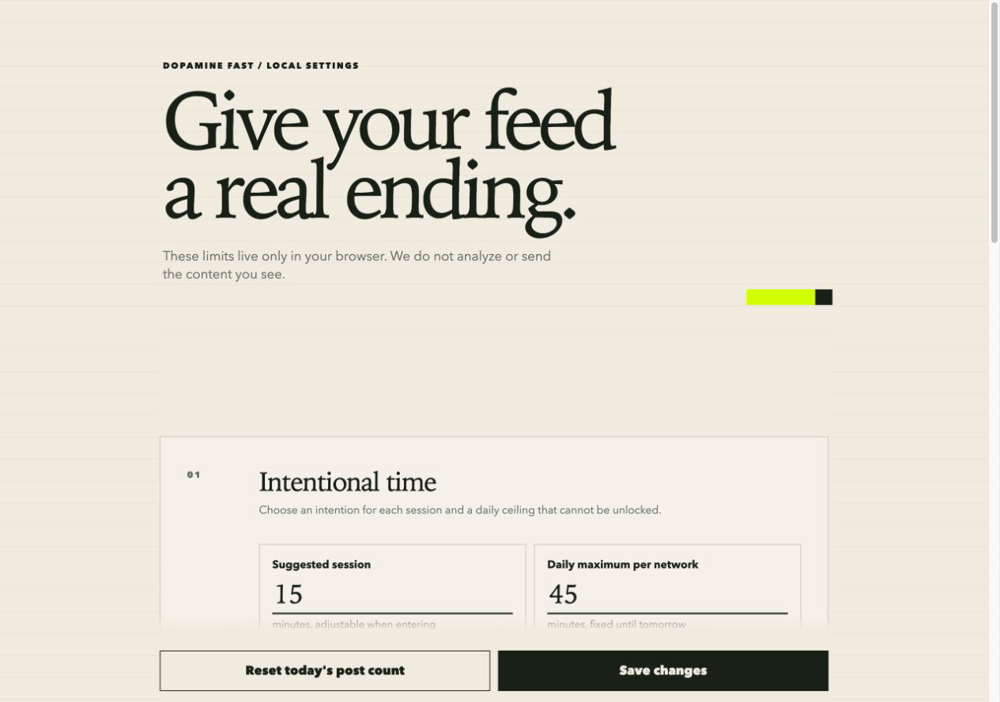
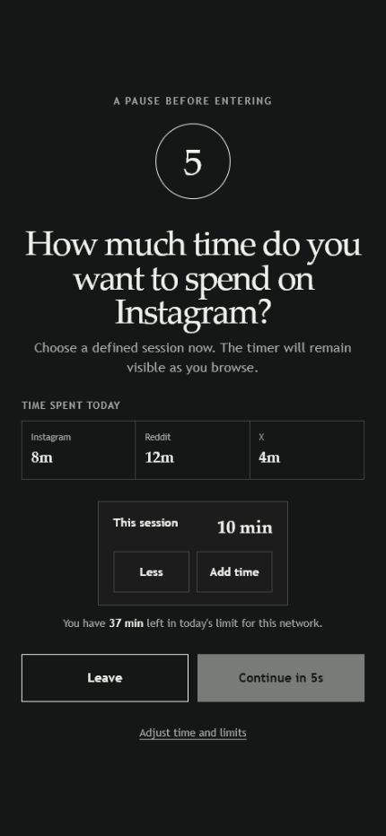

# Dopamine Fast

<p align="center">
  
</p>

Dopamine Fast is a local-first browser extension that makes social feeds finite
and intentional. It adds a pause before opening a feed, asks you to choose how
long you want to stay, and gives every scrolling session a visible ending.

The extension works on top of the authenticated websites you already use. It
does not build a new feed, copy posts, use platform APIs, inspect private
messages, or send browsing data to a backend.

> **Project status:** early prototype. Reddit, X/Twitter, Instagram, and YouTube are
> supported, but their interfaces change frequently and the selectors still
> require regular testing on mobile and desktop.



## Why it exists

Social networks are useful, but their default experience is designed around an
endless, algorithmic feed. Dopamine Fast keeps the useful parts of those sites
available while adding deliberate friction around habitual scrolling:

1. A configurable countdown interrupts automatic feed opening.
2. A small summary shows today's time spent on each supported network.
3. You choose an intended session length before entering.
4. A floating timer keeps that decision visible while you browse.
5. Posts are revealed in finite batches instead of an endless stream.
6. Reaching the end shows an inline control for loading the next batch.
7. A per-network daily time ceiling cannot be extended from the page.

Daily post allowances and time ceilings are tracked independently for Reddit,
X/Twitter, Instagram, and YouTube.
Preferences and aggregate counters stay in browser extension local storage.
Elapsed seconds per network are retained for the 30 most recent days with
activity; active session countdowns are not stored in that history.
At a closed batch boundary, blocked posts retain their layout geometry while
becoming invisible and non-interactive. The inline control also occupies the
remaining viewport, keeping native infinite-scroll loaders out of view.

## Product tour

The opening pause asks for a concrete time intention before the feed becomes
available. At the batch boundary, the feed ends with an inline button instead
of loading more posts automatically.



## Features

- Configurable delay before entering a supported feed.
- Immediate interaction guard while local settings and the opening
  intervention load, preventing clicks or scrolling through the feed first.
- Intentional session duration, adjusted through deliberate button steps, with
  a floating countdown that remains active across same-network SPA and history
  navigation.
- Optional Following-only modes for X and Instagram that select Following and
- Intentional search on X, Instagram and Reddit: autocomplete or default
  recommendations are suppressed, X and Instagram Explore stay empty until a
  deliberate query, and X result tabs plus Reddit's Popular, News and Explore
  shortcuts are hidden.
- Instagram's Reels destination is hidden; a directly opened reel or a reel
  opened from a modal remains usable without vertical navigation into an
  endless sequence.
- YouTube Shorts surfaces are hidden, and directly opened Shorts use the
  standard video player instead of the vertical Shorts feed.
- Optional YouTube Subscriptions-only mode redirects Home to Subscriptions and
  hides Home. Next-video and recommendation surfaces around requested videos
  are always hidden.
- Non-extendable daily time ceiling for each network.
- Finite initial and additional post batches.
- Stable per-session post counting for virtualized feeds such as Reddit.
- Optional delay and press-and-hold step before revealing another batch.
- Gentle, balanced, and strict friction modes.
- Best-effort suppression of suggested and promoted surfaces.
- Media autoplay prevention.
- Per-network enable or disable controls.
- Firefox and Chromium production builds.

## Supported networks

| Network | Feed limiting | Suggested-content suppression | Daily time ceiling |
| --- | --- | --- | --- |
| Reddit | Yes | Best effort | Independent |
| X / Twitter | Yes | Best effort | Independent |
| Instagram | Yes | Best effort | Independent |
| YouTube | Yes | Best effort | Independent |

The limiter applies only to recognized feed routes. Direct profiles, messages,
settings, and individual post pages are intended to remain available. Platform
DOM changes may temporarily reduce detection accuracy; when confidence is low,
the extension is designed to avoid hiding broad page containers.

## Install for development

Requirements:

- Node.js 22 or newer
- npm
- Firefox or a Chromium-based browser

Install dependencies and start a development build:

```sh
npm ci
npm run dev          # Firefox
npm run dev:chrome   # Chromium
```

Build both production packages:

```sh
npm run build
npm run build:chrome
```

WXT writes the unpacked extensions to `.output/firefox-mv2` and
`.output/chrome-mv3`. Run `npm run zip` to create distributable archives.

Firefox is the primary mobile target. For Android development, build the
Firefox package and use Mozilla's current Firefox Android extension-testing
workflow to load it.

## Architecture

Dopamine Fast uses WXT, strict TypeScript, native DOM APIs, and CSS. There is no
application UI framework or remote service.

```text
entrypoints/content.ts
  ├─ route and lifecycle orchestration
  ├─ opening pause
  ├─ intentional session timer
  └─ FeedLimiter
       ├─ platform selectors
       ├─ finite batches
       ├─ suggested-content suppression
       └─ inline load-more gate

entrypoints/background.ts
  └─ serialized daily post and time mutations

entrypoints/options/
  └─ local settings UI

lib/
  ├─ batch-gate-ui.ts
  ├─ models.ts
  ├─ storage.ts
  ├─ platforms.ts
  ├─ feed-limiter.ts
  ├─ usage-session.ts
  ├─ usage-history.ts
  ├─ intervention-ui.ts
  └─ session-time.ts
```

The content script is injected only on supported hosts. Its interface runs in
an isolated shadow root, while settings and daily counters use browser
extension local storage.

See [PRODUCT_SPEC.md](PRODUCT_SPEC.md) for intended product behavior and
[AGENTS.md](AGENTS.md) for the current architecture, invariants, known
limitations, and contributor guidance.

## Privacy and security

Dopamine Fast requests access only to Reddit, X/Twitter, Instagram, and YouTube, plus
the browser's local storage permission. It has:

- no account system;
- no analytics or telemetry;
- no cookie permission;
- no background scraping;
- no platform API credentials;
- no remote backend.

A “hard” limit means that the extension exposes no in-page bypass. It is not
tamper-proof: users retain control over their browser, extension storage, and
installed software.

## Current limitations

- Social-network selectors are inherently fragile and need ongoing manual
  verification.
- Active tabs reconcile their daily time counters whenever the background
  owner persists usage from any supported tab.
- Gentle and strict modes do not yet differ as much as the complete product
  specification intends.
- There is not yet a published browser-store installation.

## Validation

Run the complete local validation before submitting a code change:

```sh
npm run validate
```

This runs the TypeScript check, unit tests, and Firefox and Chromium production
builds. Use `npm run zip` as well for manifest, asset, build, or packaging
changes.

## Releases and dependency updates

GitHub Actions validates every pull request and packages Firefox and Chromium
artifacts.

Release Please manages versions through Conventional Commits:

- `fix:` produces a patch release;
- `feat:` produces a minor release;
- `feat!:` or `BREAKING CHANGE:` produces a major release.

After releasable changes reach `main`, Release Please opens or updates a release
pull request. Merging it creates the tag and GitHub Release, builds both browser
packages, and uploads ZIP files with SHA-256 checksums.

Dependabot checks npm and GitHub Actions weekly. Version updates are separated
into patch, minor, and major groups with cooldowns of 3, 7, and 30 days.
Security updates are not delayed by the cooldown.

Third-party actions are pinned to commit SHAs. Dependabot keeps those pins
current.

### Optional Firefox Add-ons deployment

The release workflow submits to AMO when these Actions secrets exist:

- `FIREFOX_EXTENSION_ID`
- `FIREFOX_JWT_ISSUER`
- `FIREFOX_JWT_SECRET`

The first AMO listing must be created manually. Without these secrets, GitHub
Releases continue working and the AMO step exits successfully with a notice.

`RELEASE_PLEASE_TOKEN` is optional. When provided as a fine-grained token, pull
requests created by Release Please can trigger other GitHub workflows.
Otherwise the workflow falls back to `GITHUB_TOKEN`.

## Contributing

Contributions are welcome. Read [CONTRIBUTING.md](CONTRIBUTING.md) for the
development workflow and [CODE_OF_CONDUCT.md](CODE_OF_CONDUCT.md) for the
behavior and product principles expected in this community.

## License

MIT
